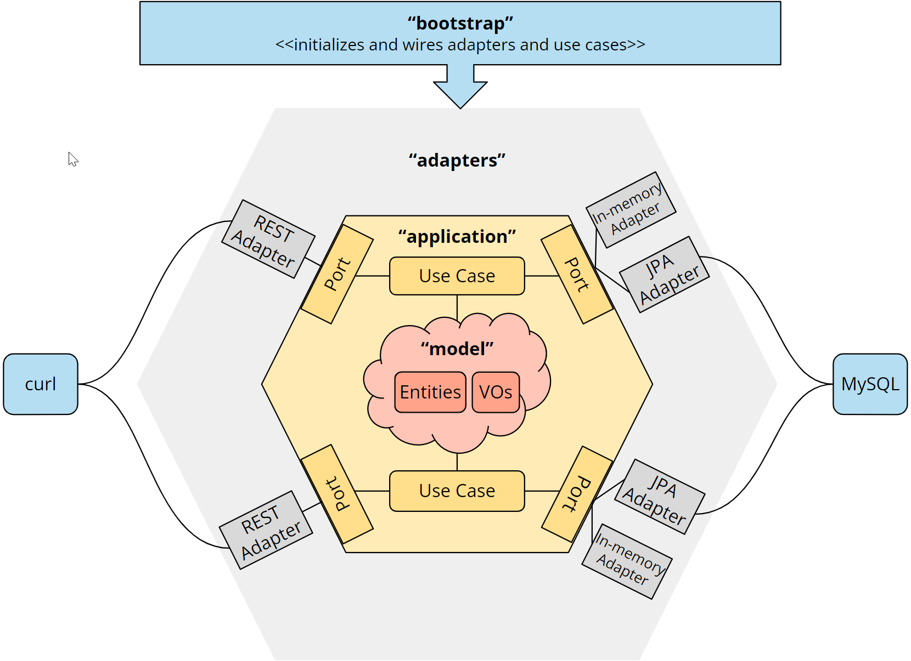

# Hexagonal Architecture in Java Tutorial

[](https://github.com/SvenWoltmann/hexagonal-architecture-java/actions/workflows/build.yml)
[](https://sonarcloud.io/dashboard?id=SvenWoltmann_hexagonal-architecture-java)
[](https://sonarcloud.io/dashboard?id=SvenWoltmann_hexagonal-architecture-java)
[](https://sonarcloud.io/dashboard?id=SvenWoltmann_hexagonal-architecture-java)
[](https://sonarcloud.io/dashboard?id=SvenWoltmann_hexagonal-architecture-java)

This repository contains a sample Java REST application implemented according to hexagonal architecture.

It is part of the HappyCoders tutorial series on Hexagonal Architecture:
* [Part 1: Hexagonal Architecture - What Is It? Why Should You Use It?](https://www.happycoders.eu/software-craftsmanship/hexagonal-architecture/).
* [Part 2: Hexagonal Architecture with Java - Tutorial](https://www.happycoders.eu/software-craftsmanship/hexagonal-architecture-java/).
* [Part 3: Ports and Adapters Java Tutorial: Adding a Database Adapter](https://www.happycoders.eu/software-craftsmanship/ports-and-adapters-java-tutorial-db/).
* [Part 4: Hexagonal Architecture with Quarkus - Tutorial](https://www.happycoders.eu/software-craftsmanship/hexagonal-architecture-quarkus/).
* [Part 5: Hexagonal Architecture with Spring Boot - Tutorial](https://www.happycoders.eu/software-craftsmanship/hexagonal-architecture-spring-boot/).

# Branches

## `main`

In the `main` branch, you'll find the application implemented without an application framework. It's only using:
* [RESTEasy](https://resteasy.dev/) (implementing [Jakarta RESTful Web Services](https://jakarta.ee/specifications/restful-ws/)),
* [Hibernate](https://hibernate.org/) (implementing [Jakarta Persistence API](https://jakarta.ee/specifications/persistence/)), and
* [Undertow](https://undertow.io/) as a lightweight web server.

## `without-jpa-adapters`

In the `without-jpa-adapters` branch, you'll find the application implemented without an application framework and without JPA adapters. It's only using RESTEasy and Undertow.

## `with-quarkus`

In the `with-quarkus` branch, you'll find an implementation using [Quarkus](https://quarkus.io/) as application framework.

## `with-spring`

In the `with-quarkus` branch, you'll find an implementation using [Spring](https://spring.io/) as application framework.

# Architecture Overview

The source code is separated into four modules:
* `model` - contains the domain model
* `application` - contains the domain services and the ports of the hexagon
* `adapters` - contains the REST, in-memory and JPA adapters
* `boostrap` - contains the configuration and bootstrapping logic

The following diagram shows the hexagonal architecture of the application along with the source code modules:



The `model` module is not represented as a hexagon because it is not defined by the Hexagonal Architecture. Hexagonal Architecture leaves open what happens inside the application hexagon. 

# How to Run the Application

The easiest way to run the application is to start the `main` method of the `Launcher` class (you'll find it in the `boostrap` module) from your IDE.

You can use one of the following VM options to select a persistence mechanism:

* `-Dpersistence=inmemory` to select the in-memory persistence option (default)
* `-Dpersistence=mysql` to select the MySQL option

If you selected the MySQL option, you will need a running MySQL database. The easiest way to start one is to use the following Docker command:

```shell
docker run --name hexagon-mysql -d -p3306:3306 \
    -e MYSQL_DATABASE=shop -e MYSQL_ROOT_PASSWORD=test mysql:8.1
```

The connection parameters for the database are hardcoded in `RestEasyUndertowShopApplication.initMySqlAdapter()`. If you are using the Docker container as described above, you can leave the connection parameters as they are. Otherwise, you may need to adjust them.


# Example Curl Commands

The following `curl` commands assume that you have installed `jq`, a tool for pretty-printing JSON strings.

## Find Products

The following queries return one and two results, respectively:

```shell
curl localhost:8080/products/?query=plastic | jq
curl localhost:8080/products/?query=monitor | jq
```

The response of the second query looks like this:
```json
[
  {
    "id": "K3SR7PBX",
    "name": "27-Inch Curved Computer Monitor",
    "price": {
      "currency": "EUR",
      "amount": 159.99
    },
    "itemsInStock": 24081
  },
  {
    "id": "Q3W43CNC",
    "name": "Dual Monitor Desk Mount",
    "price": {
      "currency": "EUR",
      "amount": 119.9
    },
    "itemsInStock": 1079
  }
]
```

## Get a Cart

To show the cart of user 61157 (this cart is empty when you begin):

```shell
curl localhost:8080/carts/61157 | jq
```

The response should look like this:

```json
{
  "lineItems": [],
  "numberOfItems": 0,
  "subTotal": null
}
```

## Adding Products to a Cart

Each of the following commands adds a product to the cart and returns the contents of the cart after the product is added (note that on Windows, you have to replace the single quotes with double quotes):

```shell
curl -X POST 'localhost:8080/carts/61157/line-items?productId=TTKQ8NJZ&quantity=20' | jq
curl -X POST 'localhost:8080/carts/61157/line-items?productId=K3SR7PBX&quantity=2' | jq
curl -X POST 'localhost:8080/carts/61157/line-items?productId=Q3W43CNC&quantity=1' | jq
curl -X POST 'localhost:8080/carts/61157/line-items?productId=WM3BPG3E&quantity=3' | jq
```

After executing two of the four commands, you can see that the cart contains the two products. You also see the total number of items and the sub-total:

```json
{
  "lineItems": [
    {
      "productId": "TTKQ8NJZ",
      "productName": "Plastic Sheeting",
      "price": {
        "currency": "EUR",
        "amount": 42.99
      },
      "quantity": 20
    },
    {
      "productId": "K3SR7PBX",
      "productName": "27-Inch Curved Computer Monitor",
      "price": {
        "currency": "EUR",
        "amount": 159.99
      },
      "quantity": 2
    }
  ],
  "numberOfItems": 22,
  "subTotal": {
    "currency": "EUR",
    "amount": 1179.78
  }
}
```

This will increase the number of plastic sheetings to 40:
```shell
curl -X POST 'localhost:8080/carts/61157/line-items?productId=TTKQ8NJZ&quantity=20' | jq
```

### Producing an Error Message

Trying to add another 20 plastic sheetings will result in error message saying that there are only 55 items in stock:

```shell
curl -X POST 'localhost:8080/carts/61157/line-items?productId=TTKQ8NJZ&quantity=20' | jq
```

This is how the error response looks like:
```json
{
  "httpStatus": 400,
  "errorMessage": "Only 55 items in stock"
}
```

## Emptying the Cart

To empty the cart, send a DELETE command to its URL:

```shell
curl -X DELETE localhost:8080/carts/61157
```

To verify it's empty:
```shell
curl localhost:8080/carts/61157 | jq
```

You'll see an empty cart again.
